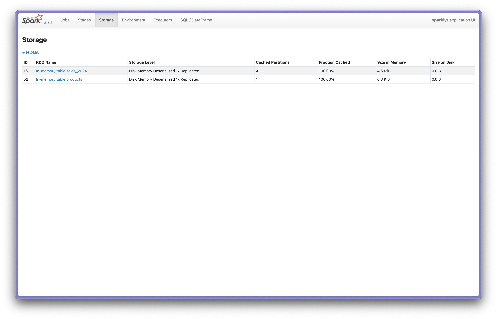
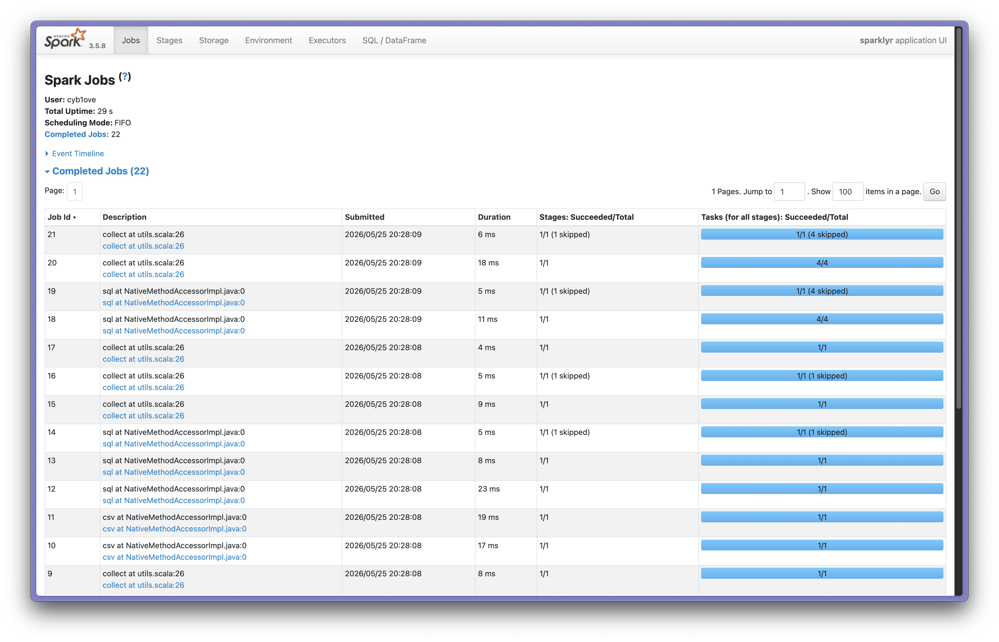
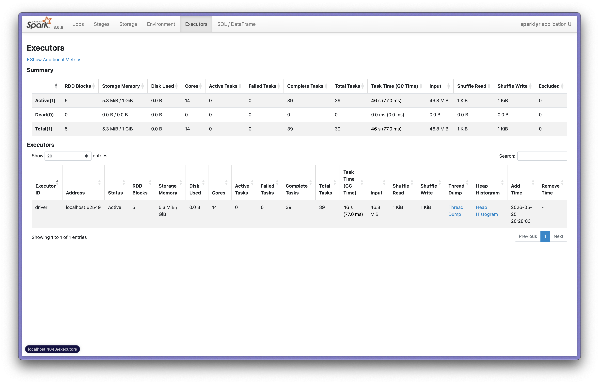

## Мета роботи

Провести аналіз продуктивності категорій та брендів інтернет-магазину за 2024 рік у розподіленому середовищі Apache Spark, використовуючи виключно R-інтерфейс `sparklyr`:

- Підключення до локального кластера Spark;
- Завантаження великих даних (500 000+ рядків) через `spark_read_csv()`;
- Аналіз через `dplyr`-інтерфейс із Spark-бекендом;
- Отримання агрегованих результатів у R через `collect()`;
- Моніторинг виконання через веб-інтерфейс Spark.

## Хід роботи

Вхідні дані:

- `sales_2024.csv` — 500 000+ записів про замовлення (order_id, customer_id, product_id, quantity, order_date);
- `products.csv` — довідник продуктів (product_id, product_name, category, brand, price).

### Етап 1: Підключення до Spark

```{r message=FALSE, warning=FALSE, include=FALSE, paged.print=FALSE}
#| label: stage-1-connect

library(sparklyr)
library(dplyr)

```

```{r}
sc <- spark_connect(master = "local")

spark_ver <- spark_version(sc)
cat("Spark version:", paste(spark_ver, collapse = "."), "\n")
```

### Етап 2: Завантаження даних

```{r}
#| label: stage-2-load

sales_spark <- spark_read_csv(
  sc,
  name = "sales_2024",
  path = "data/sales_2024.csv",
  header = TRUE,
  infer_schema = TRUE
)

products_spark <- spark_read_csv(
  sc,
  name = "products",
  path = "data/products.csv",
  header = TRUE,
  infer_schema = TRUE
)

tbl_cache(sc, "sales_2024")
tbl_cache(sc, "products")

glimpse(sales_spark)
cat("\nКількість рядків sales:", sdf_nrow(sales_spark), "\n")

glimpse(products_spark)
cat("\nКількість рядків products:", sdf_nrow(products_spark), "\n")
```

### Етап 3: Аналіз через dplyr-інтерфейс

```{r}
#| label: stage-3-analysis

top5_result <- sales_spark |>
  left_join(products_spark, by = "product_id") |>
  mutate(revenue = quantity * price) |>
  filter(revenue > 1000) |>
  group_by(category, brand) |>
  summarise(revenue = sum(revenue, na.rm = TRUE), .groups = "drop") |>
  arrange(desc(revenue)) |>
  head(5)

top5_result |> print()
```

### Етап 4: Отримання результатів у R

```{r}
#| label: stage-4-collect

top5_local <- top5_result |> collect()

cat("Клас:", class(top5_local)[1], "\n")
cat("Розмір:", nrow(top5_local), "x", ncol(top5_local), "\n\n")
print(top5_local)

stopifnot(nrow(top5_local) == 5)
cat("Перевірка: data.frame з 5 рядками")
```

### Етап 5: Моніторинг через веб-інтерфейс

```{r}
#| label: stage-5-web-ui
#| eval: false

spark_web(sc)
```

Після виконання `spark_web(sc)` у браузері відкривається Spark UI (за замовчуванням `http://localhost:4040`), де можна перевірити:

- **Storage** — чи з'явився датафрейм `sales_2024` у кеші;

- **Jobs** — чи виконалися запити (stages, tasks);

- **Executors** — скільки пам'яті використовується локальним executor'ом.


### Етап 6: Від'єднання

```{r}
#| label: stage-6-disconnect

spark_disconnect(sc)
cat("З'єднання зі Spark закрито")
```

```{=html}
<hr style="border: 1px solid #ddd; margin: 30px 0 10px 0;">
<footer style="text-align: center; font-size: 0.9em; color: #666; padding: 15px; background: #f9f9f9; border-top: 1px solid #eee; margin-top: 20px;">
  <p><strong>Виконав(ла): Зайкін Андрій</strong> | Група: КІ-25-1м | Викладач: Сидоренко В.М.</p>
  <p>Кременчуцький національний університет імені Михайла Остроградського &copy; 2025</p>
</footer>
```
